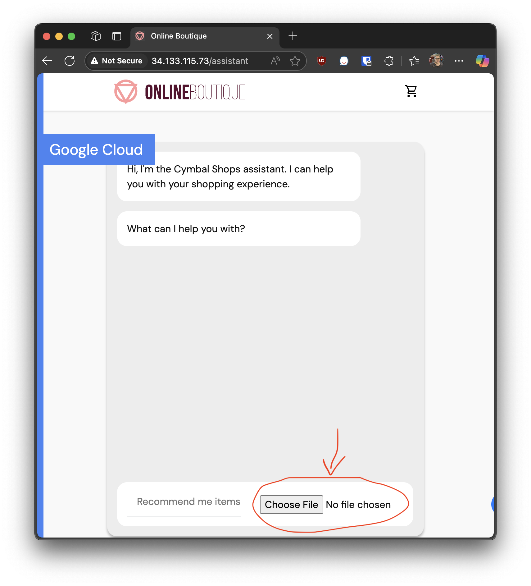
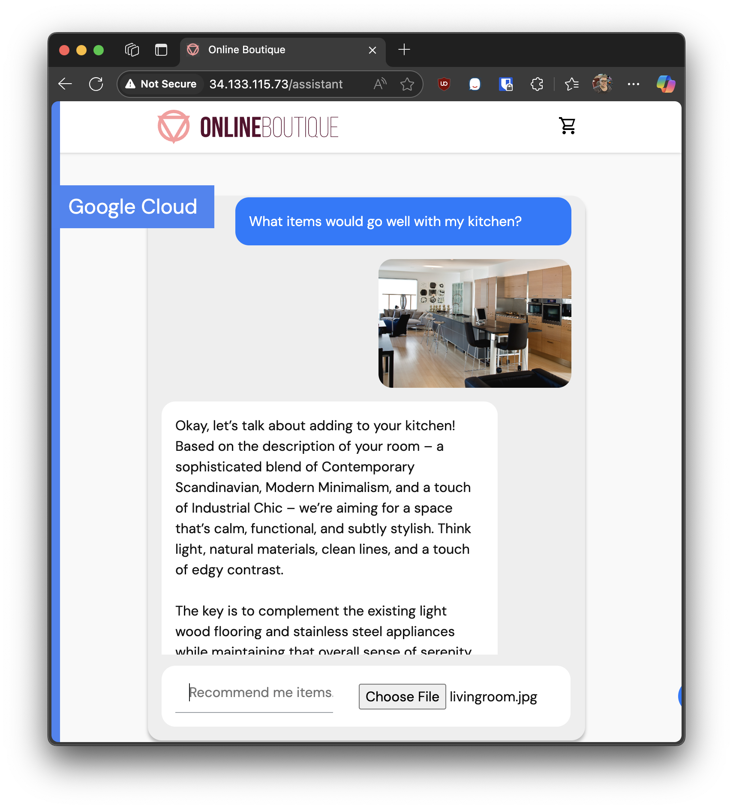

# workshop-ai-gke

A workshop for building out a AI application using Google Kubernetes Engine

TODO Avin: Confirm final "known good" location of prebuilt llm-server and shoppingassistantservice docker images. Update the image locations throughout this document and in the two kubernetes deployment files.
TODO Avin: Write a terraform file that deploys the previous workshop in ideal state (with artifact images prebuild in common artifact repo), as well as a VM the reader can work in.
TODO Avin: Write a table of contents as per Google's preference.
TODO Avin: Clarify downloading model and uploading to k8s is optional, then modifiy initcontainer to auto download

## 0. Requirements

This lab builds upon the previous example and assumes you already have a GKE cluster deployed running the [Online Boutique microservices demo application](https://github.com/GoogleCloudPlatform/microservices-demo).

If you do not, please run the previous lab first and then return to this lab.

## 1. Prepare work environment

In order to achieve the best performance, will be building Llama.cpp optimized specifically for Axion CPUs.

To do that, we'll first create a VM in Google Cloud on an Axion instance to use as our build environment.

### Create build environment VM

Get a Virtual Machine running Axion that we can work in.

TODO Michael: Attendees shouldn't do this because it'll be part of terraform, leaving for now for reference but replace with with simple ssh once terraform is making the build VM

<ql-code-block templated bash>

# Ensure the SSH key exists for gcloud at ~/.ssh/google_compute_engine.pub; generate one with empty passphrase if missing.
if [ ! -f "$HOME/.ssh/google_compute_engine.pub" ]; then
  echo "No SSH key found at ~/.ssh/google_compute_engine.pub. Generating one with an empty passphrase..."
  ssh-keygen -t rsa -b 3072 -N "" -f "$HOME/.ssh/google_compute_engine"
fi
PUB_KEY=$(cat "$HOME/.ssh/google_compute_engine.pub")

# Retrieve project from gcloud config.
PROJECT=$(gcloud config get-value project)

# Set zone to us-central1-a and derive region.
ZONE="${ZONE:-us-central1-a}"
REGION="${ZONE%-*}"

echo "GCP Project: $PROJECT"
echo "Zone: $ZONE, Region: $REGION"

# Set Ubuntu image variables for ARM64.
IMAGE_FAMILY="ubuntu-2204-lts-arm64"
IMAGE_PROJECT="ubuntu-os-cloud"

# Create an ARM-based VM using the Ubuntu ARM image.
# INSTANCE_NAME="arm-vm-$(date +%s)"
INSTANCE_NAME="mhall-workshop-build-server"
echo "Creating ARM-based instance $INSTANCE_NAME (machine type: c4a-standard-16)..."
gcloud compute instances create "$INSTANCE_NAME" \
  --zone "$ZONE" \
  --machine-type=c4a-standard-16 \
  --image-family="$IMAGE_FAMILY" \
  --image-project="$IMAGE_PROJECT" \
  --boot-disk-size 200GB \
  --tags=arm-vm \
  --metadata=ssh-keys="cos:${PUB_KEY}" \
  --network="dev-eco-nw-pb" \
  --subet="dev-eco-nw-subnet" \
  --quiet
</ql-code-block>

### Connect to build VM

First we need to copy our build files to the VM instance:

<ql-code-block templated bash>
gcloud compute scp --recurse ./server/ $INSTANCE_NAME:./server/
gcloud compute scp --recurse ./shoppingassistantservice/ $INSTANCE_NAME:./shoppingassistantservice/
</ql-code-block>

Now we can connect to the VM

<ql-code-block templated bash>
gcloud compute ssh $INSTANCE_NAME --zone $ZONE
</ql-code-block>

## 2. Prepare Llama.cpp

Build from docker file in that repo (Should build both full and Server images from one docker file)

<ql-code-block templated bash>
sudo snap install docker

cd server/
sudo docker buildx build -f Dockerfile --target full --tag llama-cpp:latest .
sudo docker buildx build -f Dockerfile --target server --tag llama-cpp-server:latest .
</ql-code-block>

Make an image from docker template to be included in this repo, using command that ensures it makes an arm64 ONLY build

### Push llm server image to artifact repository

Now that we've built the `llama-cpp-server` image, at this point we would upload the llama-cpp-server image to our Google Cloud Artifact Registry. This makes the image available for deployment within our GKE cluster. By storing the image in the artifact repository, Kubernetes can pull it directly when creating pods for the shopping assistant service.

However, to speed things up, we have one already uploaded an image to use in later steps. For reference, the following commands are an example of how you would push your newly built docker image to GCP's Project Artifact Registry

TODO Avin: Change to local artifact registry in qwiklabs (location and repo name)

<ql-code-block templated bash>
ARTIFACT_REGISTRY="us-docker.pkg.dev/scaling-llm-with-arm-and-gke"

sudo docker tag llama-cpp-server ${ARTIFACT_REGISTRY}/llama-cpp-server
gcloud auth configure-docker us-docker.pkg.dev
sudo docker push ${ARTIFACT_REGISTRY}/llama-cpp-server
</ql-code-block>

## 3. Prepare Model

Get a hugging face token and save it for this step
Download locally `google/gemma-3-4b-it` using Hugging Face.

<ql-code-block templated bash>
sudo apt update && sudo apt install -y python3-venv
python3 -m venv venv
source venv/bin/activate

export HF_TOKEN=<your_hf_token>
mkdir ./models/

huggingface-cli download --local-dir ./models/ google/gemma-3-4b-it-qat-q4_0-gguf
</ql-code-block>

Using Llama.cpp CLI image we just built, optimize it for Axion architecture

<ql-code-block templated bash>
sudo docker run -v ./models:/app/models ${DOCKER_IMAGE} --quantize --allow-requantize /app/models/gemma-3-4b-it-q4_0.gguf /app/models/gemma-3-4b-it-q4_0_arm.gguf Q4_0
</ql-code-block>

### Test quantized model

Test run the model using the llama-cpp-server docker image:

<ql-code-block templated bash>
sudo  docker run -v ./models:/app/models -p 8000:8000 ${DOCKER_IMAGE}-server --model /app/models/gemma-3-4b-it-q4_0_arm.gguf --mmproj /app/models/mmproj-model-f16-4B.gguf --alias gemma-3-4b-it-arm --port 8000 --host 0.0.0.0
</ql-code-block>

Then, in another terminal, run:

<ql-code-block templated bash>
curl -X POST "http://localhost:8000/v1/chat/completions" \
	-H "Content-Type: application/json" \
	--data '{
		"messages": [
			{
				"role": "user",
				"content": [
					{
						"type": "text",
						"text": "Describe this image in one sentence."
					},
					{
						"type": "image_url",
						"image_url": {
							"url": "https://tile.loc.gov/storage-services/service/pnp/ppbd/00600/00631v.jpg"
						}
					}
				]
			}
		]
	}'
</ql-code-block>

There should be a json response within a minute or so that looks like it answers the question.

You can see the Llama.cpp logs with the following command:
<ql-code-block templated bash>
sudo docker container logs <container_id> --since 10m
</ql-code-block>

### Download quantized model

To download the quantized models from your VM to your normal development environment:

Get out of the ssh with `exit`, then copy the model files to your local machine:

<ql-code-block templated bash>
exit
gcloud compute scp --recurse $INSTANCE_NAME:~/models/ ./models/
</ql-code-block>

`$INSTANCE_NAME` is the name of the virtual machine we were just working in.

## 3. Prepare Shopping Assistant

Now we need to build the shoppingassistantserver. Navigate to the folder we uploaded previously and build the docker image:

<ql-code-block templated bash>
cd shoppingassistantservice/src/
sudo docker buildx build -f Dockerfile --tag shoppingassistantservice:latest .
</ql-code-block>

### Push shopping assistant image to artifact repository

Once again we will need the `shoppingassistantservice` image we just made to be in an Google Cloud Artifact Registry. We have already done so for later steps, but for reference if you'd like to push the image yourself use the following commands:

TODO Avin: Change to local artifact registry in qwiklabs (location and repo name)

<ql-code-block templated bash>
ARTIFACT_REGISTRY="us-docker.pkg.dev/scaling-llm-with-arm-and-gke"

sudo docker tag shoppingassistantservice ${ARTIFACT_REGISTRY}/shoppingassistantservice
gcloud auth configure-docker us-docker.pkg.dev
sudo docker push ${ARTIFACT_REGISTRY}/shoppingassistantservice
</ql-code-block>

## 4. Deploy Llama.cpp kubernetes

Now it is time to deploy our server to our Kubernetes cluster.

Leave the VM we were working in before using `exit` and get back to your console.

### Storage

Before we can deploy our service however, need to create a Storage Class and Persistent Volume Claim to store our model files.

Let's review the two files:

#### `server/k8s/storage-class.yml`

Make a storage class that works with `C4A` class compute. "`persistent`" storage is not available on `C4A`, needs to be "`hyperdisk`"

Deploy the storage class first:

<ql-code-block templated bash>
kubectl apply -f server/k8s/storage-class.yml
</ql-code-block>

#### `server/k8s/pvc.yml`

This sets up our model persistent volume storage we will mount to our server pod.

Deploy it after defining the storage class:

<ql-code-block templated bash>
kubectl apply -f server/k8s/pvc.yml
</ql-code-block>

### Deploy service

Now it's time to deploy our service and pod for the server.

<ql-code-block templated bash>
kubectl apply -f server/k8s/deploy.yml
</ql-code-block>

This will create an initial container that waits until the model files are uploaded, and then will run our llama.cpp server using an image just like the one we built earlier.

### Upload model to Kubernetes

Now we need to load our model files into the persistent storage we just created in our GKE.

We need to copy our model files into the `ensure-files` initContainer. Since the storage will be shared by all pods that mount it, once we copy the file in it will be accessible by our `llm` container.

<ql-code-block templated bash>
kubectl cp ./models/ temp-loader-pod:/ -c ensure-files --disable-compression
</ql-code-block>

Ensure your paths are correct. Give it a minute for the command to upload the file, this may take a moment due to size.

Once the folder is updated successfully, the initContainer should resolve itself and automatically start the server.

## 5. Test AI

Let's run a curl command on our pod and double check everything works:

<ql-code-block templated bash>
kubectl exec llm-server -- curl -X POST "http://localhost:8000/v1/chat/completions" \
  -H "Content-Type: application/json" \
  --data '{
		"messages": [
			{
				"role": "user",
				"content": [
					{
						"type": "text",
						"text": "Describe this image in one sentence."
					},
					{
						"type": "image_url",
						"image_url": {
							"url": "https://tile.loc.gov/storage-services/service/pnp/ppbd/00600/00631v.jpg"
						}
					}
				]
			}
		]
	}'
</ql-code-block>

We should get a json response that looks like it answers the question.

## 6. Deploy Shopping Assistant

This will create the deployment and service in your cluster for the Shopping Assistant we built earlier.

This container will connect to our already deployed and working `llm-server` service.

Apply the Kubernetes kustomization to update our project to use the shoppingassistantservice:

<ql-code-block templated bash>
kubectl apply -k shoppingassistantservice/k8s/
</ql-code-block>

## 7. Test the Shopping Assistant Application

Everything should be working! Let's try it out.

### Find the External IP

To access the Shopping Assistant, first retrieve the external IP address of the `shoppingassistantservice`:

<ql-code-block templated bash>
kubectl get svc frontend-external
</ql-code-block>

Look for the `EXTERNAL-IP` column in the output. Once you have the IP, open your browser and go to:

<ql-code-block templated bash>
http://<External IP>/assistant
</ql-code-block>

### 2. Interact with the Assistant

You will see the chat interface as shown below:

Here, you can upload an image and type a question related to the image or the product catalog. For example, you might upload a photo of your kitchen and ask for a recommendation.

### 3. Example Response

After submitting your question, the assistant will analyze the image and your query, then respond with relevant information. An example response is shown below:

## Scalability with Arm and Google Kubernetes Engine

This AI system is designed to be fully scalable for real-world production environments by leveraging the power of Arm-based CPUs and Google Kubernetes Engine (GKE). By containerizing the Llama.cpp server and Shopping Assistant service, you can easily deploy, manage, and scale these components across multiple nodes in your GKE cluster. Arm architecture provides cost-effective, energy-efficient compute resources, enabling you to handle increased workloads without sacrificing performance.

GKE’s orchestration capabilities allow for automated scaling, rolling updates, and high availability, ensuring your AI application can respond to changing demand and maintain reliability. Persistent storage and artifact repositories further support seamless model management and deployment. With this architecture, you can confidently run large-scale AI workloads, optimize resource usage, and deliver robust services to end users.

Thank you for participating in this workshop!
