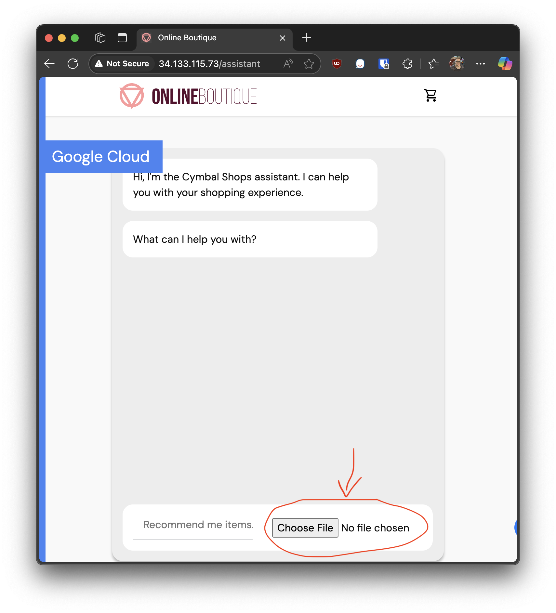
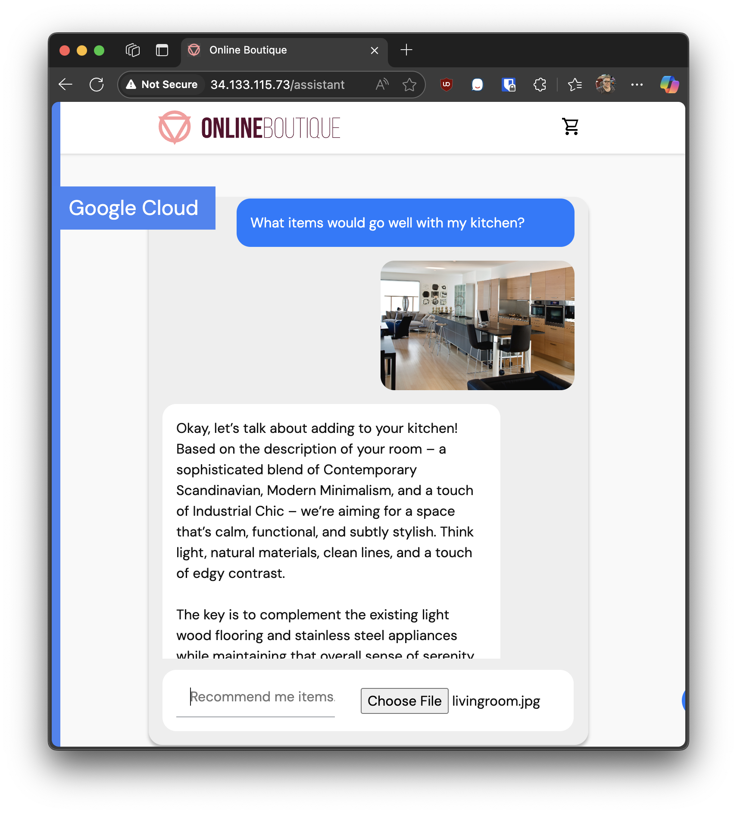

# Scaling LLM deployments with Arm and Google Kubernetes Engine

*This lab was developed with our partner, [Arm](https://www.arm.com/).
<!-- markdownlint-disable MD033 -->

## ISV048

![[/fragments/labmanuallogo]]

## Overview

This workshop guides developers through building and scaling an AI application using Google Kubernetes Engine (GKE) and Arm-based CPUs. Participants will learn how to optimize Llama.cpp for Arm architecture, containerize an LLM service, and modify the Shopping Assistant service from the [Google Microservices Demo](https://github.com/GoogleCloudPlatform/microservices-demo) to use that LLM service, then deploy these components on a GKE cluster for robust, scalable AI workloads.

### Objectives

In this lab you will learn how to:

* Connect to a build environment using Arm based Axion VMs in Google Cloud.
* Build and push Docker images for AI services to Google Artifact Registry.
* Quantize an AI model for efficient inference on Arm CPUs.
* Configuring persistent storage and deploying services with Kubernetes manifests.
* Integrate our AI service into the Shopping Assistant component of the [Google Microservices Demo](https://github.com/GoogleCloudPlatform/microservices-demo).
* Test and access the deployed application via public Kubernetes endpoint.

By the end of the workshop, developers will understand best practices for leveraging Arm architecture and GKE orchestration to achieve cost-effective, high-performance, and scalable AI deployments in production environments.

### Prerequisites

* A basic understanding of [Google Kubernetes Engine](https://www.cloudskillsboost.google/focuses/878?parent=catalog).
* A basic understanding of the [Google Microservices Demo](https://github.com/GoogleCloudPlatform/microservices-demo). This lab will start with a deploy version of this project.

## Setup and requirements

![[/fragments/startqwiklab]]

![[/fragments/gcpconsole]]

![[/fragments/cloudshell]]

## Task 1. Prepare work environment

First step is to clone the workshop repository from Arm, run the following command in your Cloud Shell or terminal:

<ql-code-block language="bash">
git clone https://github.com/ArmDeveloperEcosystem/workshop-ai-gke.git
</ql-code-block>

Change into the cloned directory:

<ql-code-block language="bash">
cd workshop-ai-gke
</ql-code-block>

### Connect to build VM

In order to achieve the best performance, will be building Llama.cpp optimized specifically for Axion CPUs.

To do that, we'll connect to a VM in Google Cloud running an Axion based processor to use as our build environment.

First we need to copy our build files to the VM instance:

<ql-code-block language="bash" templated>
gcloud compute scp --recurse ./server/src/ {{{project_0.startup_script.vm_instance_name|VM_INSTANCE_NAME}}}:./server --zone {{{project_0.startup_script.vm_instance_zone|VM_ZONE}}}
gcloud compute scp --recurse ./shoppingassistantservice/src/ {{{project_0.startup_script.vm_instance_name|VM_INSTANCE_NAME}}}:./shoppingassistantservice --zone {{{project_0.startup_script.vm_instance_zone|VM_ZONE}}}
</ql-code-block>

Now we can connect to the VM:

<ql-code-block language="bash" templated>
gcloud compute ssh --zone {{{project_0.startup_script.vm_instance_zone|VM_ZONE}}} {{{project_0.startup_script.vm_instance_name|VM_INSTANCE_NAME}}} --project {{{project_0.project_id|PROJECT_ID}}}
</ql-code-block>

### Install Docker

We will need to install Docker on our VM:

<ql-code-block language="bash" templated>
sudo snap install docker
</ql-code-block>

## Task 2. Prepare Shopping Assistant

Now in our VM, we need to build the shoppingassistantserver. Navigate to the folder we uploaded previously and build the docker image:

<ql-code-block language="bash">
cd ~/shoppingassistantservice/
sudo docker buildx build -f Dockerfile --tag shoppingassistantservice:latest .
</ql-code-block>

### Push shopping assistant image to artifact repository

Next we can push the `shoppingassistantservice` image we just made to an Google Cloud Artifact Registry. This makes the image available for deployment within our GKE cluster. By storing the image in the artifact repository, Kubernetes can pull it directly when creating pods for the shopping assistant service.

**THIS STEP IS OPTIONAL**: We have already uploaded an image to a common repository. These steps are for reference if you'd like to push the image yourself:

Log into your gcloud on the VM using the lab's credentials:

<ql-code-block language="bash" templated>
sudo gcloud auth login --no-launch-browser
</ql-code-block>

Then tag and push our docker images to our projects artifact registry:

<ql-code-block language="bash" templated>
export ARTIFACT_REGISTRY="{{{project_0.default_region|REGION}}}-docker.pkg.dev/{{{project_0.project_id|PROJECT_ID}}}/{{{project_0.startup_script.artifact_repo|REPO}}}"
sudo docker tag shoppingassistantservice $ARTIFACT_REGISTRY/shoppingassistantservice
sudo gcloud auth configure-docker {{{project_0.default_region|REGION}}}-docker.pkg.dev
sudo docker push $ARTIFACT_REGISTRY/shoppingassistantservice
</ql-code-block>

## Task 3. Prepare Llama.cpp

In addition to the shopping service, we need a backend to server our LLM model. We also need a tool to quantize our model to be more efficient on Axion processors. We will use use different Llama.cpp builds for these tasks.

The server docker file we uploaded to our VM earlier can make both images we need.

First navigate to the server folder we copied into our VM:

<ql-code-block language="bash">
cd ~/server/
</ql-code-block>

Then build our full llama-cpp docker image:

<ql-code-block language="bash">
sudo docker buildx build -f Dockerfile --target full --tag llama-cpp:latest .
</ql-code-block>

Next the server docker image:

<ql-code-block language="bash">
sudo docker buildx build -f Dockerfile --target server --tag llama-cpp-server:latest .
</ql-code-block>

Now our images are ready to use.

### Push llm server image to artifact repository

Now that we've built the `llama-cpp-server` image, at this point once again we would upload the llama-cpp-server image to our Google Cloud Artifact Registry.

**THIS STEP IS OPTIONAL**: To speed things up, we have one already uploaded an image to a common repository for use in later steps. The following commands are an example for reference:

Log into your gcloud on the VM using the lab's credentials:

<ql-code-block language="bash" templated>
sudo gcloud auth login --no-launch-browser
</ql-code-block>

Then tag and push our docker images to our projects artifact registry:

<ql-code-block language="bash" templated>
export ARTIFACT_REGISTRY="{{{project_0.default_region|REGION}}}-docker.pkg.dev/{{{project_0.project_id|PROJECT_ID}}}/{{{project_0.startup_script.artifact_repo|REPO}}}"
sudo docker tag llama-cpp-server $ARTIFACT_REGISTRY/llama-cpp-server
sudo gcloud auth configure-docker {{{project_0.default_region|REGION}}}-docker.pkg.dev
sudo docker push $ARTIFACT_REGISTRY/llama-cpp-server
</ql-code-block>

## Task 4. Prepare Model

In this task we will get a hugging face token, download the model, and quantize it.

Navigate to the root folder:

<ql-code-block language="bash">
cd ~/
</ql-code-block>

Now prepare our VM environment to download the model using Hugging Face:

<ql-code-block language="bash">
sudo apt update && sudo apt install -y python3-venv
python3 -m venv venv
source venv/bin/activate

pip install -U "huggingface_hub[cli]"

mkdir ./models/
</ql-code-block>

### Verify Hugging Face access to LLM repos

If you haven't already done so:

* Go to [Hugging Face Gated Repositories](https://huggingface.co/settings/gated-repos) and make sure **google/gemma-3-4b-it-qat-q4_0-gguf** is listed.
* If it is not listed:
  * Go to [https://huggingface.co/google/gemma-3-4b-it-qat-q4_0-gguf](https://huggingface.co/google/gemma-3-4b-it-qat-q4_0-gguf)
  * Click the **Agree and Access Repository** button

### Create Access Token

* Go to [Hugging Face Access Tokens](https://huggingface.co/settings/tokens)
* Click the **Create new token** on the top right
* Change **Token type** to **Read**
* Give it any name
* Click the **Create token** button
* Copy the value to your clipboard and save it somewhere.

In addition to wherever you save your token, let's export it as a local variable in our build environment:

<ql-code-block language="bash">
export HF_TOKEN=YOUR_HUGGINGFACE_TOKEN
</ql-code-block>

### Download Model

With our token and python virtual environment all set up, download the model to the `./model/` folder we just made:

<ql-code-block language="bash">
huggingface-cli download --local-dir ./models/ google/gemma-3-4b-it-qat-q4_0-gguf
</ql-code-block>

Now using the Llama.cpp CLI image we built, optimize the model for Axion architecture:

<ql-code-block language="bash">
sudo docker run -v ./models:/app/models llama-cpp --quantize --allow-requantize /app/models/gemma-3-4b-it-q4_0.gguf /app/models/gemma-3-4b-it-q4_0_arm.gguf Q4_0
</ql-code-block>

### Test quantized model

Test run the model using the llama-cpp-server docker image:

<ql-code-block language="bash">
sudo docker run -d -v ./models:/app/models -p 8000:8000 --name llama-cpp-server llama-cpp-server --model /app/models/gemma-3-4b-it-q4_0_arm.gguf --mmproj /app/models/mmproj-model-f16-4B.gguf --alias gemma-3-4b-it-arm --port 8000 --host 0.0.0.0
</ql-code-block>

The docker image should be running in the background, try and connect to it:

<ql-code-block language="bash">
curl -X POST "http://localhost:8000/v1/chat/completions" \
    -H "Content-Type: application/json" \
    --data '{
        "messages": [{
            "role": "user",
            "content": [
                { "type": "text", "text": "Describe this image in one sentence." },
                { "type": "image_url", "image_url": { "url": "https://tile.loc.gov/storage-services/service/pnp/ppbd/00600/00631v.jpg" } }
            ]
        }]
    }'
</ql-code-block>

There should be a json response within a minute or so that looks like it answers the question:

<ql-code-block output language="json">
{"choices":[{"finish_reason":"stop","index":0,"message":{"role":"assistant","content":"This is a modern, open-plan living space featuring a large kitchen island, comfortable seating, and a sleek, minimalist design."}}],"created":1759775152,"model":"gemma-3-4b-it-arm","system_fingerprint":"b6700-3df2244d","object":"chat.completion","usage":{"completion_tokens":27,"prompt_tokens":276,"total_tokens":303},"id":"chatcmpl-ySMx8l9kc1YJlUVh3p9tOdTiHAOBlcXm","timings":{"cache_n":0,"prompt_n":276,"prompt_ms":43655.196,"prompt_per_token_ms":158.17100000000002,"prompt_per_second":6.322271465692193,"predicted_n":27,"predicted_ms":1542.703,"predicted_per_token_ms":57.13714814814815,"predicted_per_second":17.501748554323157}}
</ql-code-block>

You can see the Llama.cpp logs with the following command:

<ql-code-block language="bash">
sudo docker container logs llama-cpp-server --since 10m
</ql-code-block>

### Download quantized model

To download the quantized models from your VM to your normal development environment:

Get out of the VM ssh's with `exit`:

<ql-code-block language="bash">
exit
</ql-code-block>

You should now be back to your cloud shell console.

We can then download quantized versions of the models. You can use models we quantized in advance, or download the model files from your VM:

<ql-code>
<ql-code-block language="bash" tabTitle="Download Model">
gcloud storage cp --recursive gs://isv048-scaling-llm-with-arm-and-gke/models/ .
</ql-code-block>
<ql-code-block language="bash" tabTitle="Copy from VM" templated>
# `{{{project_0.startup_script.vm_instance_name|VM_INSTANCE_NAME}}}` is the name of the virtual machine we were just working in.
gcloud compute scp --recurse {{{project_0.startup_script.vm_instance_name|VM_INSTANCE_NAME}}}:~/models/ ./models/ --zone {{{project_0.startup_script.vm_instance_zone|VM_ZONE}}}
</ql-code-block>
</ql-code>

## Task 5. Deploy Llama.cpp kubernetes

Now it is time to deploy our server to our Kubernetes cluster.

### Connect to the Cluster

To manage resources in your Kubernetes cluster, you need to connect to it using `kubectl`. This allows you to run commands that interact directly with the cluster. Use the following command to configure `kubectl` to connect to your cluster:

<ql-code-block language="bash" templated>
gcloud container clusters get-credentials {{{project_0.startup_script.cluster_name|CLUSTER_NAME}}} --region {{{project_0.startup_script.cluster_location|CLUSTER_LOCATION}}} --project {{{project_0.project_id|PROJECT_ID}}}
</ql-code-block>

### Storage

Before we can deploy our service, need to create a Storage Class and Persistent Volume Claim to store our model files.

Let's review the two files:

#### `server/k8s/storage-class.yml`

Make a storage class that works with `C4A` class compute. "`persistent`" storage is not available on `C4A`, needs to be "`hyperdisk`"

Deploy the storage class first:

<ql-code-block language="bash">
kubectl apply -f server/k8s/storage-class.yml
</ql-code-block>

#### `server/k8s/pvc.yml`

This sets up our model persistent volume storage we will mount to our server pod.

Deploy it after defining the storage class:

<ql-code-block language="bash">
kubectl apply -f server/k8s/pvc.yml
</ql-code-block>

### `server/k8s/temp.yml`

To upload our model files into Kubernetes, we need to make a temporary pod to load our model files into the persistent storage we just created in our GKE.

First, create the temporary pod:

<ql-code-block language="bash">
kubectl apply -f server/k8s/temp.yml
</ql-code-block>

Since the storage will be shared by all pods that mount it, once we copy the file in it will be accessible by our `llm` container.

Copy the files:

<ql-code-block language="bash">
kubectl cp ./models/ temp-loader-pod:/ --disable-compression
</ql-code-block>

Ensure your paths are correct. Give it a minute for the command to upload the file, this may take a moment due to size.

**NOTE:** Don't move your browser away from your cloud shell to prevent it from disconnecting early.

Once the folder is updated successfully, we no longer need the temporary pod, and can delete it:

<ql-code-block language="bash">
kubectl delete -f server/k8s/temp.yml
</ql-code-block>

### Deploy service

Now it's time to deploy our backend llm service and pod.

<ql-code-block language="bash">
kubectl apply -f server/k8s/deploy.yml
</ql-code-block>

This will run our llama.cpp server using an image just like the one we built earlier.

## Task 6. Test AI

Let's run a curl command on our pod and double check everything works.

To get the name of our server pod, run the following command:

<ql-code-block language="bash">
kubectl get pods | grep ^llm
</ql-code-block>

You'll see the name of the pod we just deployed, it should look something like this:

<ql-code-block output noWrap>
llm-server-66575d6d5b-jgfn2              0/1     Init:0/1   0          10s
</ql-code-block>

Replace `llm-server-POD-NAME` with the name of the pod:

<ql-code-block language="bash">
kubectl exec llm-server-POD-NAME -- curl -X POST "http://localhost:8000/v1/chat/completions" \
    -H "Content-Type: application/json" \
    --data '{
        "messages": [{
            "role": "user",
            "content": [
                { "type": "text", "text": "Describe this image in one sentence." },
                { "type": "image_url", "image_url": { "url": "https://tile.loc.gov/storage-services/service/pnp/ppbd/00600/00631v.jpg" } }
            ]
        }]
    }'
</ql-code-block>

We should get a json response that looks like it answers the question:

<ql-code-block output language="json">
{"choices":[{"finish_reason":"stop","index":0,"message":{"role":"assistant","content":"This is a modern, open-plan living space featuring a large kitchen island, comfortable seating, and a sleek, minimalist design."}}],"created":1759775152,"model":"gemma-3-4b-it-arm","system_fingerprint":"b6700-3df2244d","object":"chat.completion","usage":{"completion_tokens":27,"prompt_tokens":276,"total_tokens":303},"id":"chatcmpl-ySMx8l9kc1YJlUVh3p9tOdTiHAOBlcXm","timings":{"cache_n":0,"prompt_n":276,"prompt_ms":43655.196,"prompt_per_token_ms":158.17100000000002,"prompt_per_second":6.322271465692193,"predicted_n":27,"predicted_ms":1542.703,"predicted_per_token_ms":57.13714814814815,"predicted_per_second":17.501748554323157}}
</ql-code-block>

Click **Check my progress**__** to verify that your model is deployed the Llama.cpp server correctly.
<ql-activity-tracking step=1>
   Deployed LLM Service
</ql-activity-tracking>

## Task 7. Deploy Shopping Assistant

This will create the deployment and service in your cluster for the Shopping Assistant we built earlier.

This container will connect to our already deployed and working `llm-server` service.

Apply the Kubernetes kustomization to update our project to use the shoppingassistantservice:

<ql-code-block language="bash">
kubectl apply -k shoppingassistantservice/k8s/
</ql-code-block>

Click **Check my progress** to verify that the shopping assistant service is deployed the Llama.cpp server correctly.
<ql-activity-tracking step=2>
   Deployed Shopping Assistance Service
</ql-activity-tracking>

## Task 8. Test the Shopping Assistant Application

Everything should be working! Let's try it out.

### Find the External IP

To access the Shopping Assistant, first retrieve the external IP address of the `shoppingassistantservice`:

<ql-code-block language="bash">
kubectl get svc frontend-external
</ql-code-block>

Look for the `EXTERNAL-IP` column in the output.

<ql-code-block output noWrap>
NAME                TYPE           CLUSTER-IP      EXTERNAL-IP     PORT(S)        AGE
frontend-external   LoadBalancer   34.118.239.84   35.238.33.131   80:31416/TCP   31m
</ql-code-block>

Once you have the IP, open your browser and go to:

<ql-code-block language="bash">
http://EXTERNAL-IP/assistant
</ql-code-block>

### Interact with the Assistant

You will see the chat interface as shown below:

Here, you can upload an image and type a question related to the image or the product catalog. For example, you might upload a photo of your kitchen and ask for a recommendation.

### Example Response

After submitting your question, the assistant will analyze the image and your query, then respond with relevant information. An example response is shown below:

## Scalability with Arm and Google Kubernetes Engine

This AI system is designed to be fully scalable for real-world production environments by leveraging the power of Arm-based CPUs and Google Kubernetes Engine (GKE). By containerizing the Llama.cpp server and Shopping Assistant service, you can easily deploy, manage, and scale these components across multiple nodes in your GKE cluster. Arm architecture provides cost-effective, energy-efficient compute resources, enabling you to handle increased workloads without sacrificing performance.

GKE’s orchestration capabilities allow for automated scaling, rolling updates, and high availability, ensuring your AI application can respond to changing demand and maintain reliability. Persistent storage and artifact repositories further support seamless model management and deployment. With this architecture, you can confidently run large-scale AI workloads, optimize resource usage, and deliver robust services to end users.

Thank you for participating in this workshop!

**Manual last updated**: October 16th, 2025
**Manual Last tested**: October 16th, 2025

![[/fragments/copyright]]
